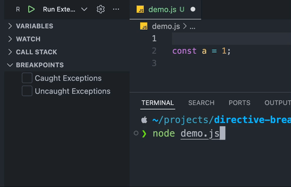
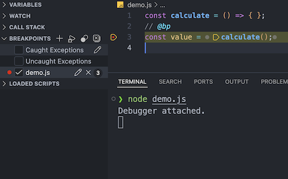
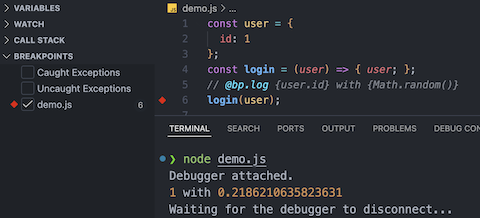
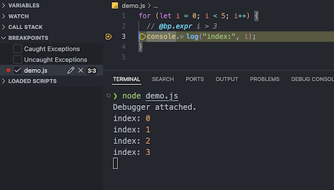
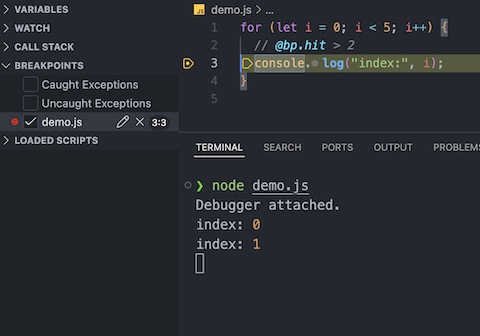
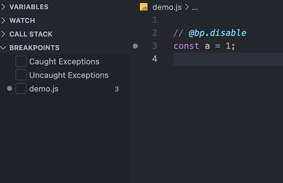
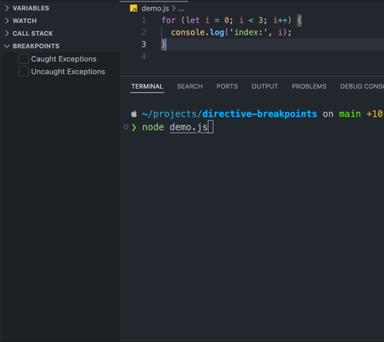
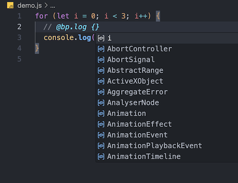
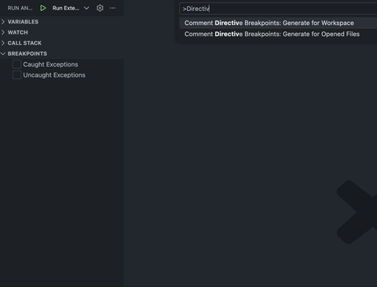
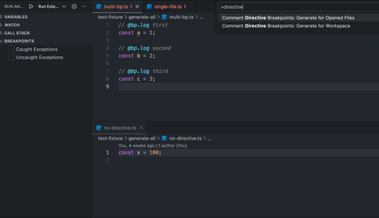

<div align="center"><sub>
English | <a href="https://github.com/char8x/comment-directive-breakpoints/blob/main/README_zh.md" target="_blank">简体中文</a>
</sub></div>

# Comment Directive Breakpoints

[](https://marketplace.visualstudio.com/items?itemName=char8x.comment-directive-breakpoints)
[](https://github.com/char8x/comment-directive-breakpoints/releases/latest)


Generate and manage VS Code breakpoints directly from your source code using comment directives.



## Features & Usage

> [!TIP]
> The built-in [JavaScript Debug Terminal](https://code.visualstudio.com/docs/nodejs/nodejs-debugging#_javascript-debug-terminal) in VS Code is highly recommended and works perfectly with this extension. It allows you to debug your Node.js / frontend projects directly without any `launch.json` configuration!

### 1. Directive-Based Breakpoints

Set standard, conditional, hit-count breakpoints or logpoints using simple comments. Simply add a comment starting with `// @bp` (or the appropriate comment style for your language) followed by an optional directive.

#### Basic Breakpoint

Set a standard breakpoint at the associated line of code.

```typescript
// @bp
const value = calculate();
```



#### Logpoints (@bp.log)

Log a message to the debug console when the breakpoint is hit. Use `{}` for expression interpolation.

```typescript
// @bp.log {user.id} with {Math.random()}
login(user);
```



#### Conditional Breakpoints (@bp.expr)

Break execution only when the expression evaluates to true.

```typescript
for (let i = 0; i < 5; i++) {
  // @bp.expr i > 3
  console.log('index:', i);
}
```



#### Hit Count Breakpoints (@bp.hit)

Break execution when the hit count condition is met (e.g., `> 5`, `== 10`).

```typescript
for (let i = 0; i < 5; i++) {
  // @bp.hit > 2
  console.log('index:', i);
}
```



#### Disabled Breakpoints (.disable)

Add `.disable` to any directive to create a breakpoint that is initially disabled.

```typescript
// @bp.disable
// @bp.hit.disable 5
// @bp.log.disable value: {v}
```



### 2. Real-time Update

Automatically updates breakpoints when you save your file.

When `settings.json` is configured as follows, the extension completely takes over the generation and removal of breakpoints in the current file.

```json
{
  "comment-directive-breakpoints.general.generateOnSave": true,
  "comment-directive-breakpoints.general.breakpointManagementMode": "replace"
}
```



### 3. Smart Autocompletion

Get context-aware code suggestions for your expressions while writing `@bp.log` or `@bp.expr` directives.



### 4. Workspace & Open File Scanning

Automatically find and generate breakpoints across your entire workspace or just within your currently opened files.

#### Scan Workspace

**Command:** `Comment Directive Breakpoints: Generate for Workspace`
Scans the entire workspace for directives and generates breakpoints.



#### Scan Opened Files

**Command:** `Comment Directive Breakpoints: Generate for Opened Files`
Scans only the files currently open in your editor.



## Configuration

You can configure the extension in your `settings.json`:

```json
{
  "comment-directive-breakpoints.general.generateOnSave": true,
  "comment-directive-breakpoints.general.supportedLanguages": [
    "javascript",
    "typescript",
    "javascriptreact",
    "typescriptreact",
    "python",
    "go",
    "ruby",
    "java",
    "rust"
  ],
  "comment-directive-breakpoints.general.breakpointManagementMode": "append",
  "comment-directive-breakpoints.ripgrep.path": ""
}
```

## Supported Languages

The extension currently only supports languages with built-in Tree-Sitter WASM parsers. Other languages are not yet supported.

Currently supported:

- JavaScript / TypeScript / JSX / TSX
- Python
- Go
- Rust
- Java
- Ruby

## Contributing

Contributions are welcome! Please feel free to submit a Pull Request.

## License

[MIT](LICENSE)
